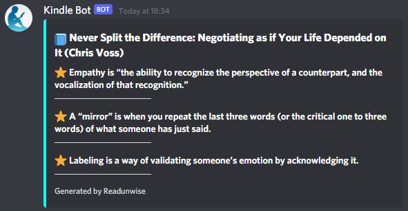

## readunwise

Send randomly selected Kindle highlights to a Discord channel. A simple alternative to [Readwise](https://readwise.io/)

Run as a cron job e.g. every day at 9am: `0 9 * * * python3 home/pi/readunwise/src/readunwise.py <args>`

```
usage: readunwise.py [-h] [-n N_HIGHLIGHTS] [-i IGNORED_BOOKS [IGNORED_BOOKS ...]]
                     clippings_file discord_token discord_channel

Send randomly selected Kindle highlights to a Discord channel.

positional arguments:
  clippings_file        clippings text file from Kindle device (/documents/My Clippings.txt)
  discord_token         discord bot authentication token
  discord_channel       discord channel ID

optional arguments:
  -h, --help            show this help message and exit
  -n N_HIGHLIGHTS       number of highlights to select (default: 3)
  -i IGNORED_BOOKS [IGNORED_BOOKS ...]
                        titles of books to ignore
```


